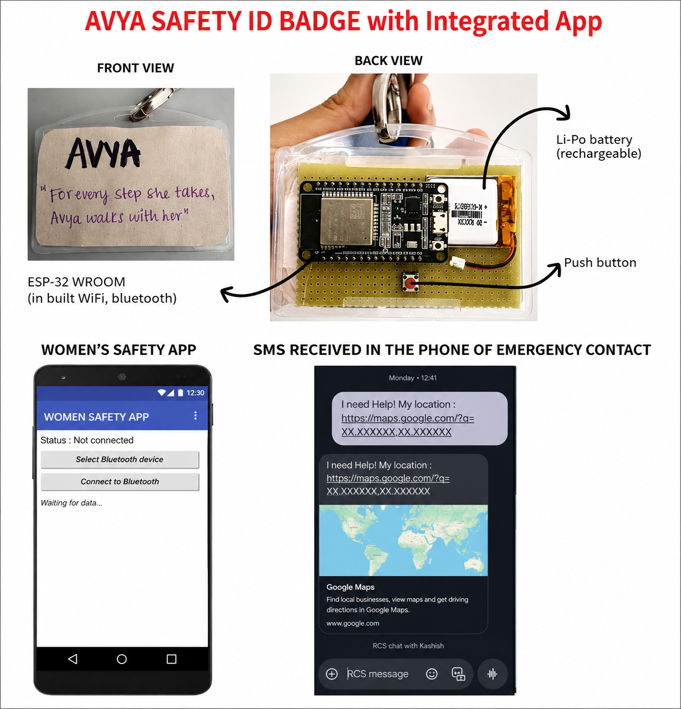
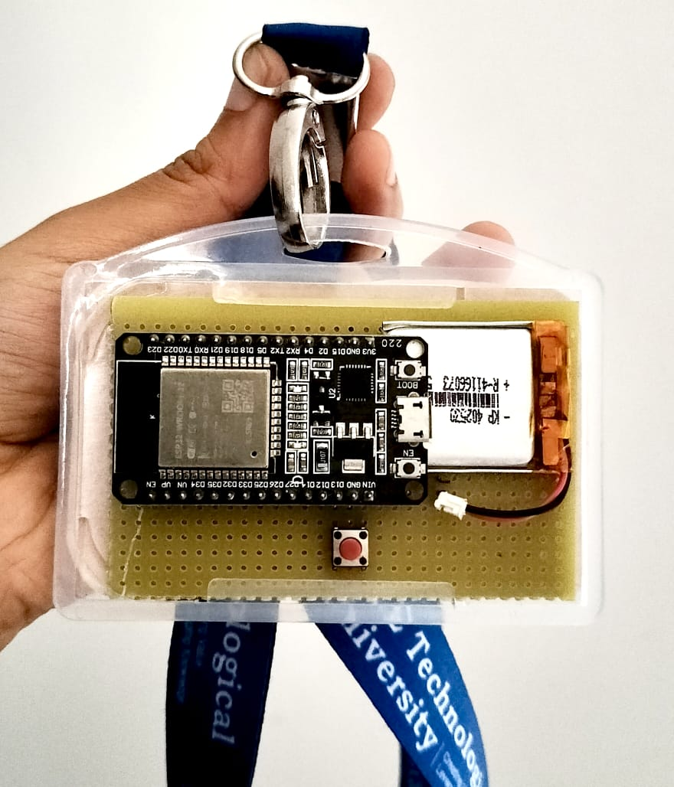

# AVYA Smart Safety ID Badge

> An ESP32-based smart safety ID badge designed to provide quick SOS communication through Bluetooth, a mobile application, live location sharing, and emergency SMS alerts.



## 📌 Overview

AVYA Smart Safety ID Badge is a compact wearable safety system designed to provide a simple and quick method for sending an emergency alert.

The system combines an ESP32-WROOM, a hidden push button, Bluetooth communication, and an Android application developed using MIT App Inventor.

When the user presses the hidden emergency button, the ESP32 detects the trigger and sends an SOS signal to the mobile application through Bluetooth. The application then generates a predefined emergency message along with the user's live location and sends the alert through SMS to an emergency contact.

## 🎯 Objectives

- Provide a compact and wearable personal safety solution.
- Enable quick SOS triggering using a physical button.
- Establish wireless communication between the ESP32 and mobile application.
- Share the user's live location during an emergency.
- Send an emergency SMS to a predefined contact.
- Develop a low-cost and practical safety prototype.

## ⚙️ System Working

The system operates through the following sequence:

1. The ESP32-based badge is powered ON.
2. The ESP32 pairs with the mobile phone through Bluetooth.
3. The system remains in an idle state.
4. The user presses the hidden SOS button.
5. The ESP32 detects the button trigger.
6. An SOS signal is transmitted to the mobile application through Bluetooth.
7. The mobile application generates a predefined emergency message and obtains the live location.
8. The application sends the emergency message through SMS.
9. The emergency contact receives the alert containing the location information.

## 🔄 System Flow

```text
User presses SOS button
        ↓
ESP32 detects trigger
        ↓
SOS signal sent through Bluetooth
        ↓
Mobile application receives SOS
        ↓
Application generates emergency message
        ↓
Live location is included
        ↓
Emergency SMS is sent
        ↓
Emergency contact receives alert
```

## 🔧 Hardware Components

- ESP32-WROOM development board
- Push button for SOS triggering
- Rechargeable Li-Po battery
- ID badge enclosure
- Prototype board
- Connecting wires

## 💻 Software & Technologies

- Arduino IDE
- Embedded C/C++
- ESP32 Bluetooth
- MIT App Inventor
- Android mobile application
- SMS communication
- Location services

## 📱 Mobile Application

The mobile application acts as the communication interface between the ESP32 badge and the emergency contact.

The application:

- Connects to the ESP32 through Bluetooth.
- Receives the SOS trigger.
- Generates a predefined emergency message.
- Obtains the user's live location.
- Sends the emergency alert through SMS.

The MIT App Inventor project is available here:

[Download MIT App Inventor Project](AVYA_Safety_App.aia)

## 🛠️ ESP32 Firmware

The ESP32 firmware is available here:

[View ESP32 Source Code](SAFETY_BADGE_ID.ino)

The firmware configures the SOS button using an internal pull-up resistor and establishes Bluetooth communication using the ESP32 Bluetooth interface.

When the button is pressed, the ESP32 transmits an `SOS` message to the connected mobile application.

## 📷 Prototype

### Hardware Device



### Complete System


## 📊 System Flowchart

The complete system flowchart is available here:

[View System Flowchart](Documentation/AVYA_System_Flowchart.pdf)

## 📂 Repository Structure

```text
AVYA-Smart-Safety-ID-Badge/
│
├── README.md
├── SAFETY_BADGE_ID.ino
├── AVYA_Safety_App.aia
│
├── Images/
│   ├── AVYA_Device.jpeg
│   └── AVYA_Prototype_Overview.png
│
└── Documentation/
    └── AVYA_System_Flowchart.pdf
```
## 🚀 Future Improvements

The following improvements can be considered for future versions of the AVYA Smart Safety ID Badge:

- **Independent GPS integration** for obtaining the user's location without depending on the smartphone.
- **Improved battery management** to increase operating time and reduce power consumption.
- **Compact custom PCB design** to reduce the overall size of the device.
- **Improved enclosure design** with better durability and protection against dust and water.
- **Multiple emergency contacts** for sending alerts to more than one predefined contact.
- **Emergency escalation mechanism** if the initial emergency contact does not respond.
- **Additional safety sensors** for monitoring environmental or user-related safety parameters.
- **Cloud-based monitoring** for storing and monitoring emergency events.
- **Improved mobile application interface** with additional safety and emergency-management features.

## 🧪 Prototype Status

AVYA Smart Safety ID Badge is currently implemented as a **working prototype** demonstrating the integration of:

- ESP32-based SOS triggering
- Bluetooth communication
- Mobile application interaction
- Emergency message generation
- Live location sharing
- Emergency SMS communication

The prototype is intended to demonstrate the feasibility of a compact wearable safety system.

## ⚠️ Safety & Usage Note

This project is intended for **educational, prototyping, and demonstration purposes**.

The prototype should not be considered a replacement for certified emergency or personal safety systems. Before practical deployment, the hardware, battery system, wireless communication, software, and emergency-alert mechanism should be thoroughly tested for reliability and safety.

Emergency contact details should be configured by the user before testing the SMS alert functionality.

## 👥 Project Information

**Project:** AVYA Smart Safety ID Badge  
**Platform:** ESP32-WROOM  
**Mobile Application:** MIT App Inventor  
**Communication:** Bluetooth  
**Alert Method:** Emergency SMS  
**Development Environment:** Arduino IDE

## 📄 License

This project is provided for educational and research purposes. You are free to study and modify the source code for learning and prototype development.

## ⭐ Acknowledgement

This project demonstrates the integration of embedded systems, wireless communication, mobile application development, and location-based emergency alerting to create a compact wearable safety prototype.


